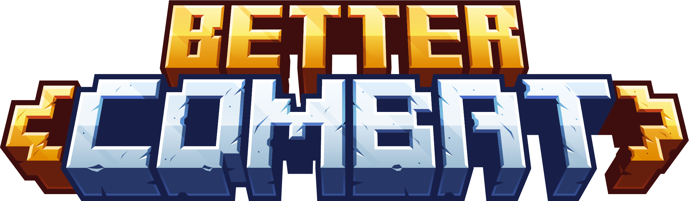

<div align="center">

  <a href=""></a>
  <a href=""></a>
  <a href="">[](https://discord.gg/KN9b3pjFTM)</a>

</div>

Easy, spectacular and fun melee combat system we know from Minecraft Dungeons.

Add unique behaviour to your weapon, or just reuse a preset, using data files (aka JSON API).

# ⭐️ Features

## Primary features
- [X] Weapons have combos (each attack in the combo can be different in many ways)
- [X] Better weapon idle and attack animations
- [X] Upswing weapon before hitting for natural look and feel
- [X] No more pixel hunting for target in front, accurate weapon swing calculation (based on [OBB](https://www.sciencedirect.com/topics/computer-science/oriented-bounding-box)+[SAT](https://en.wikipedia.org/wiki/Hyperplane_separation_theorem))
- [X] Hitting multiple enemies with a single strike
- [X] Weapon attributes are synchronized (server sends to client)
- [x] Bundled resources: weapon animations, weapon sounds, weapon attribute presets
- [x] Integrate any weapon from any mod by just creating data files

## Auxiliary features
- [X] Two-handed weapons ignore offhand slot
- [X] Movement speed reduction while attacking (Server configurable)
- [X] Attacking with dual wielded weapons (Server configurable)
- [X] Cancel attack during upswing (aka "feint") (Client configurable)
- [X] Hold attack key to spam attack (Client configurable)
- [X] Target in hitbox indication (Client configurable)
- [X] Swing thru grass (Client configurable)
- [X] Can disable mining with weapons (Client configurable)

## Compatibility features
- [X] Dedicated compatibility (Add weapon attribute data files for individual items, to specify their animations and behaviour) aka JSON API 
- [X] Fallback compatibility (Tries to automatically assign the correct type of weapon attributes to weapons without attribute file. Highly configurable)
- [X] NBT compatibility (Weapon attributes can be read from ItemStack NBT). For example:
```
/give @p minecraft:wooden_sword{weapon_attributes:'{"parent":"bettercombat:claymore"}'} 1
```

## Future plans:
- [ ] Weapon trail animation while hitting
- [ ] Parry (under consideration)
- [ ] Additional weapon attributes (for example: pushback)

# 🔧 Configuration

## Client

### Fabric

You can access the client side settings via the [Mod Menu](https://github.com/TerraformersMC/ModMenu).

### Forge

You can access the client side settings in Main Menu > Mods > Better Combat > Config.

## Server

Fallback compatibility configuration can be found at: `/config/bettercombat/fallback_compatibility.json`

Use fallback compatibility configuration to add compatibility for any weapon on your server. All weapon attributes are synchronized with clients upon joining the server. 

Server config can be found at: `/config/bettercombat/server.json5`

Server configuration is synchronized with clients upon joining the server. 

# 🔨 Integrate your mod

The next steps describe how to add dedicated compatibility for any item.

## Installation

### Fabric

Download the latest release version of the mod with all of its dependencies, and put them into `./run/mods` director.

Alternatively, if you would like to use the JAVA API provided by Better Combat. Install it via gradle:
```groovy
repositories {
    maven { url 'https://api.modrinth.com/maven' }  
}

dependencies {
    [...]
    modImplementation "maven.modrinth:better-combat:VERSION-fabric"
}
```
(Note: JAVA API is only needed for special integration cases.)

Please note for both Forge and Fabric, [Cloth Config](https://shedaniel.gitbook.io/cloth-config/setup-cloth-config/cloth-config-fabric) and [playerAnimator](https://github.com/KosmX/minecraftPlayerAnimator#include-in-your-dev-environment) are required as well. Please see each link on how to add these to your dev environments.

### Forge
```groovy
repositories {
    maven { url 'https://api.modrinth.com/maven' }  
}

dependencies {
    [...]
    implementation fg.deobf('maven.modrinth:better-combat:VERSION-forge')
}
```
Please note for both Forge and Fabric, [Cloth Config](https://shedaniel.gitbook.io/cloth-config/setup-cloth-config/cloth-config-fabric) and [playerAnimator](https://github.com/KosmX/minecraftPlayerAnimator#include-in-your-dev-environment) are required as well. Please see each link on how to add these to your dev environments.

## Prerequisite

Make sure to remove or disable all logic from your mod that is semantically conflicting with this mod:
- Player animation and or model modifications
- Attack range modifications
- Attack timing or cooldown logic modifications
- Custom attack sound playback
- Attack/mining key handler modifications (of MinecraftClient)
- Dual wielding logic
- Custom item wielding appearance 

(Note: Better Combat expects all items to be held like swords, it rotates them accordingly during animations. If you have a dagger that is facing backwards, you need to disable that, otherwise it will be facing backwards during attack animations too. Better Combat offers weapon specific poses for adjusting position and rotation of items while idling.)

## Basics

Weapon attributes describe the behaviour of a weapon including: range, combos (list of attacks), animations and sounds, etc...

Assign weapon attributes to weapons of your mod, just by creating **resource files**. This is done similar to how you assign crafting recipes to an item.
**No need for any java dependency**.

Weapon attributes can describe:
- How the weapon is held (is two-handed, idle pose)
- Attack range
- List of attack moves (aka Combo), attacks have the following properties
  - Damage
  - Hitbox
  - Conditions
  - Animation
  - Sounds

Each mod should provide their own resources files for compatibility (preferably within their jar file) for the following reasons:
- A single source of configuration files is difficult to maintain
- More intuitive installation process for users
- Every mod developer should decide how their weapon is meant to behave
- Some mods may need to disable semantically conflicting features (mentioned at [Prerequisite](#prerequisite))

Let's see an example where we add attributes to a custom sword named "Big Sword" from your mod:
- mod id is `my-mod-id`
- id of the item is `my-mod-id:big_sword`

To assign weapon attributes to the Big Sword, create a new json file at the following location:

```resources/data/my-mod-id/weapon_attributes/big_sword.json```

The content of this json file should be the following:

## Using a preset

Presets are out of the box collection of weapon attributes bundled with this mod, covering the common weapon types.

A fitting preset for a big two handed sword is the `claymore` from Better Combat, its identifier is: `bettercombat:claymore`. To use this preset add the following content to your JSON file:

```
{
  "parent": "bettercombat:claymore"
}
```

You can check out all available presets [here](/common/src/main/resources/data/bettercombat/weapon_attributes).

You can check out how presets are used to add compatibility for Vanilla weapons [here](/common/src/main/resources/data/minecraft/weapon_attributes).

You can make and reference your own presets the same way.

## Custom attributes

If you want unique behaviour for your weapon, you can create attributes from scratch.

The content of your weapon attributes JSON file is parsed into an [AttributesContainer](https://github.com/ZsoltMolnarrr/BetterCombat/blob/main/src/main/java/net/bettercombat/api/AttributesContainer.java) object. (Check out the inline java documentation of [AttributesContainer](https://github.com/ZsoltMolnarrr/BetterCombat/blob/main/src/main/java/net/bettercombat/api/AttributesContainer.java) for details.)

When no parent is specified, the value for `"attributes"` key must be a full json object that can be parsed into [WeaponAttributes](https://github.com/ZsoltMolnarrr/BetterCombat/blob/main/src/main/java/net/bettercombat/api/WeaponAttributes.java) object.

```
{
  "attributes": { ... }
}
```

Check out the existing [weapon presets](common/src/main/resources/data/bettercombat/weapon_attributes) to see practical examples of building from scratch.

Check out the available [attack animations](common/src/main/resources/assets/bettercombat/attack_animations), bundled with Better Combat. 

If you need more details, the java documentation of [WeaponAttributes](common/src/main/java/net/bettercombat/api/WeaponAttributes.java) covers all the specifics.

---

When `"parent"` and `"attributes"` are both specified, you can customize attributes by partially (or fully) overriding the properties. Make sure the inheritance results in fully parsable [WeaponAttributes](https://github.com/ZsoltMolnarrr/BetterCombat/blob/main/src/main/java/net/bettercombat/api/WeaponAttributes.java) object.

(Attributes are merged in parent -> child order. So parent properties are copied and overridden with child. The chain of inheritance can be any length.)
```
{
  "parent": "bettercombat:claymore",
  "attributes": {
    "attack_range": 3.5
    "attacks": [
      {
        "angle": 100
      },
      {
        "damageMultiplier": 0.1 
      },
      {
        "damageMultiplier": 0.3,
        "angle" = 90
      }
    ]
  }
}
```

---

You can create and use your own presets:
```
{
  "parent": "my-mod-id:longsword",
  "attributes": { ... }
}
```

## Custom animations

Let's say you want to create a custom attack animation with the following name: `big_sword_slash`

### Creating animation

Create keyframe animations using our Blender model, that includes an export script creating animation files.

Check out the [Animation guide](animations/README.md) for details.


### Adding animation

Add the created animation to the following location

```resources/assets/my-mod-id/attack_animations/big_sword_slash.json```

### Using the animation

You can use your custom animation by referencing it, following the resource identifier pattern. 

Make sure to specify a fitting `upswing` value next to your animation (to make it look and feel nice to use).

```
{
  // ...
  "attributes": {
    // ...
    "attacks": [
      {
        "animation": "my-mod-id:big_sword_slash",
        "upswing": 0.5
      },
      // ...
    ]
  }
}
```

# 📦 Using datapacks

You can create datapacks to add dedicated compatibility for any weapon.

⚠️ Caution! Some mods may have conflicting features, that causes incorrect appearance or behaviour of weapons, even if compatibility is added. In this case mod developers need to resolve incompatibilities. (Check [mod compatibility](https://github.com/ZsoltMolnarrr/BetterCombat#-mod-compatibility) section for potential source of problems.)

Steps:
1. [Create a datapack](https://minecraft.fandom.com/wiki/Tutorials/Creating_a_data_pack)
2. Add weapon attribute files based on our [integration guide](https://github.com/ZsoltMolnarrr/BetterCombat#-integrate-your-mod), the easiest way to [use existing presets](https://github.com/ZsoltMolnarrr/BetterCombat#using-a-preset) of Better Combat

For example, adding compatibility for an item with id `fruits:banana_sword` from Fruits mod, to make it act like a `claymore`, would look like the following.

File path:
```
DataPackName/data/fruits/weapon_attributes/banana_sword.json
```

Content:
```
{
  "parent": "bettercombat:claymore"
}
```


# ⛓ Mod compatibility

This mod has been created in the spirit of maximal compatibility. However since some core mechanics are overridden, mods trying to change the same thing will never be compatible.

Mods with one or more of these features are considered as a semantic incompatibility
- Dual wielding implementation
- Attack range modifications
- Attack timing or attack cooldown logic modifications
- Attack/mining key handler modifications (of MinecraftClient)
- Player model modification

# ✍️ Contribution

Before committing yourself to implementing any change for the project, it is strongly suggested to check with us on Discord. The project has a strong vision for what technical solutions are accepted, and what features belong to the scope of the project.

Avoid creating pull requests with the following content:
- huge code changes
- feature that is out of scope
- feature that already exist in some form
